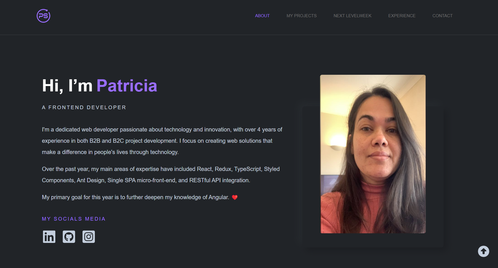

# Portfolio

Welcome to my portfolio! This is a showcase of my work and skills in web development.



[Patricia Segantine Portfolio Website](https://patriciasegantine-portfolio.vercel.app/)

## Technologies Used

- React
- Vite
- TypeScript
- Styled Components
- Font Awesome Icons
- React-vertical-timeline-component
- Material UI
- Swiper
- Vercel

## Getting Started

To run this project locally, follow the steps below:

1. Make sure you have Node.js and npm installed on your machine.
2. Clone this repository.
3. Navigate to the project directory.
4. Install the dependencies by running the following command: ```` npm install ````

5. Start the development server with the following command:
   ```` npm dev ````

6. This will launch the project in your browser at [http://localhost:4000](http://localhost:4000).

## Build

1. To build the project for production, use the following command: ``` npm build ```

2. This will generate an optimized and minified version of your project in the `dist` directory.

## Development Note:

Please be aware that this project is still under active development. While we strive to deliver a complete and
feature-rich experience, some functionalities may not be fully operational or meet expectations at this time.

I greatly appreciate your patience and support.

Feel free to explore my project, which focuses on daily care and well-being. If you have any questions or would like to
collaborate, please don't hesitate to get in touch!

— Patricia Segantine
